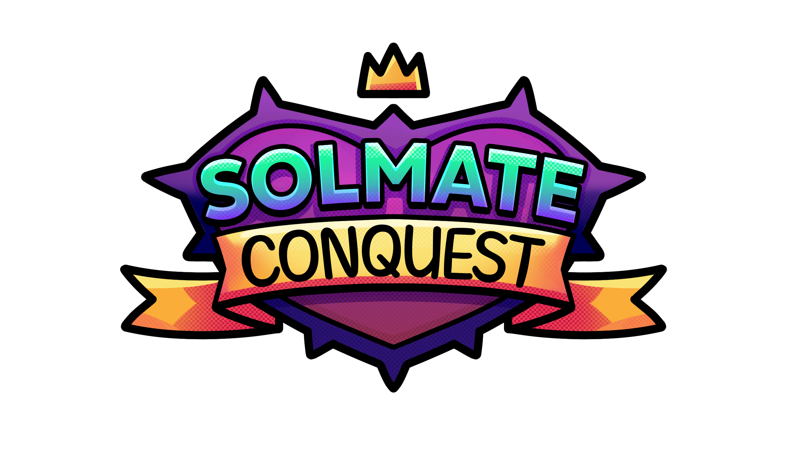

# Solmate Conquest

  

> A Unity-based mini-game collection with secure Solana blockchain integration
>
> **Play now at [solmate.quest](https://solmate.quest)**

## 🎮 About Solmate Conquest

Solmate Conquest is a Unity-based game that combines fun mini-games with secure Solana blockchain integration. Players can enjoy various mini-games like FlappyCoin and have their scores securely stored on the Solana blockchain. The game implements a robust account management system that ensures wallet security and data persistence between game sessions.

## 🚀 Key Features

- **Mini-Game Collection**: Play engaging mini-games including FlappyCoin with more to come
- **Blockchain Score Tracking**: Game scores are securely stored on Solana blockchain
- **Secure Wallet Management**: Private keys securely stored between sessions
- **Robust Error Handling**: Graceful recovery from network issues or blockchain errors
- **Cross-Scene Persistence**: Account manager maintains state across different game scenes

## 🛠️ Technical Implementation

### Blockchain Integration
- Integration with Solana blockchain via Solana.Unity SDK
- Secure player account creation and management
- Transaction handling with proper timeout and error recovery
- On-chain player data storage and retrieval
- Solana program at [https://github.com/sacada-studio/program](https://github.com/sacada-studio/program)

### Architecture
- Singleton design pattern for global access to core managers
- Asynchronous blockchain operations with proper error handling
- Scene-independent account persistence
- Clean separation between game logic and blockchain operations

## 📚 Code Structure

- **AccountManager.cs**: Core singleton that manages blockchain connectivity and player accounts
- **SolmateProgram.cs**: Defines the interface to interact with the custom Solana program
- **Mini-Games**: Individual games in the `MINIGAMES JOGOS 👾` directory
  - **FlappyCoin**: Flappy Bird-style game with blockchain score integration

## 🔧 How It Works

1. **Account Management**:
   - Creates/loads player wallet from secure storage
   - Establishes connection to Solana blockchain
   - Fetches player data from blockchain

2. **Gameplay**:
   - Player enjoys mini-games like FlappyCoin
   - Scores are tracked during gameplay
   - When game ends, scores are sent to blockchain with proper error handling

3. **Blockchain Operations**:
   - Player scores are stored securely on-chain
   - Global player data is synchronized between game sessions
   - Robust error handling ensures game doesn't freeze on network issues

## 🚀 Getting Started

### Prerequisites
- Unity 2021 or newer
- Account.txt file with Solana wallet mnemonic (for development)

### Development Setup
1. Clone this repository
2. Add your mnemonic to account.txt in the Assets folder (development only)
3. Open project in Unity
4. Run the game from the main scene

### Important Security Notes
- Never commit account.txt to version control
- The project is already configured to ignore sensitive data in .gitignore

## 🧠 Design Decisions

- **Wallet Management**: Secure loading from external file rather than hardcoded values
- **Error Recovery**: Timeout-based approach for blockchain operations to prevent game freezing
- **Singleton Pattern**: For easy access to account manager across different game scenes
- **UI Integration**: Score display updated directly from blockchain data

## 🔮 Future Development

- Add more mini-games with blockchain integration
- Implement NFT rewards for high scores
- Create global leaderboards based on blockchain data
- Add multiplayer functionality

## 📄 License

This project is licensed under the MIT License - see the LICENSE file for details.

## 🔗 Links

- **Play the Game**: [https://solmate.quest](https://solmate.quest)
- **Solana Program Repository**: [https://github.com/sacada-studio/program](https://github.com/sacada-studio/program)

---

Built with Unity and Solana
 